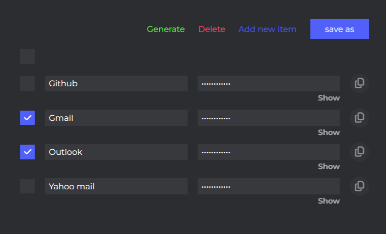

<!-- Improved compatibility of back to top link: See: https://github.com/othneildrew/Best-README-Template/pull/73 -->
<!--
*** Thanks for checking out the Best-README-Template. If you have a suggestion
*** that would make this better, please fork the repo and create a pull request
*** or simply open an issue with the tag "enhancement".
*** Don't forget to give the project a star!
*** Thanks again! Now go create something AMAZING! :D
-->


<!-- PROJECT SHIELDS -->
<!--
*** I'm using markdown "reference style" links for readability.
*** Reference links are enclosed in brackets [ ] instead of parentheses ( ).
*** See the bottom of this document for the declaration of the reference variables
*** for contributors-url, forks-url, etc. This is an optional, concise syntax you may use.
*** https://www.markdownguide.org/basic-syntax/#reference-style-links
-->

<!-- PROJECT LOGO -->
<br />
<div align="center">
  <a href="https://github.com/Tharushag/vault">
    
  </a>

<h3 align="center">Vault</h3>

  <p align="center">
    This is a simple web application built with Express.js and MongoDB that allows users to store and manage website credentials securely.
    <br />
    <a href="https://github.com/Tharushag/vault">View Demo</a>
    ·
    <a href="https://github.com/Tharushag/vault/issues">Report Bug</a>
    ·
    <a href="https://github.com/Tharushag/vault/issues">Request Feature</a>
  </p>
</div>


<!-- TABLE OF CONTENTS -->
<details>
  <summary>Table of Contents</summary>
  <ol>
    <li>
      <a href="#about-the-project">About The Project</a>
      <ul>
        <li><a href="#built-with">Built With</a></li>
      </ul>
    </li>
    <li>
      <a href="#getting-started">Getting Started</a>
      <ul>
        <li><a href="#prerequisites">Prerequisites</a></li>
        <li><a href="#installation">Installation</a></li>
      </ul>
    </li>
    <li><a href="#contributing">Contributing</a></li>
    <li><a href="#license">License</a></li>
    <li><a href="#contact">Contact</a></li>
    <li><a href="#acknowledgments">Acknowledgments</a></li>
  </ol>
</details>


<!-- ABOUT THE PROJECT -->
## About The Project

<br/>
<div align="center">
  
</div>
<br/>

I created a secure password manager web application using Express.js and MongoDB. This project served a dual purpose - enhancing my programming skills and providing a safe means to store my passwords. It was an ideal way to transition back into coding after a lengthy academic hiatus.

### Built With

* Node.js
* Express.js
* MongoDB
* scss

<!-- GETTING STARTED -->
## Getting Started

To get a local copy up and running follow these simple example steps.

### Prerequisites

* Node.js
* MongoDB
* npm

### Installation

1. Clone the repo
```
git clone https://github.com/Tharushag/vault.git
```
2. Install NPM packages
```
npm install
```
3. Run MongoDB server
```
mongod
```
4. Execute js file
```
node index.js
```

<!-- CONTRIBUTING -->
## Contributing

Contributions are what make the open source community such an amazing place to learn, inspire, and create. Any contributions you make are **greatly appreciated**.

If you have a suggestion that would make this better, please fork the repo and create a pull request. You can also simply open an issue with the tag "enhancement".
Don't forget to give the project a star! Thanks again!

1. Fork the Project
2. Create your Feature Branch (`git checkout -b feature/AmazingFeature`)
3. Commit your Changes (`git commit -m 'Add some AmazingFeature'`)
4. Push to the Branch (`git push origin feature/AmazingFeature`)
5. Open a Pull Request

<!-- LICENSE -->
## License

Distributed under the MIT License. See `LICENSE.txt` for more information.

<!-- CONTACT -->
## Contact

Tharusha - tharushadgunawardane@gmail.com

Project Link: [https://github.com/Tharushag/vault](https://github.com/Tharushag/vault)

<!-- ACKNOWLEDGMENTS -->
## Acknowledgments

* <a href="https://www.flaticon.com/free-icons/vault" title="vault icons">Vault icons created by Nikita Golubev - Flaticon</a>
